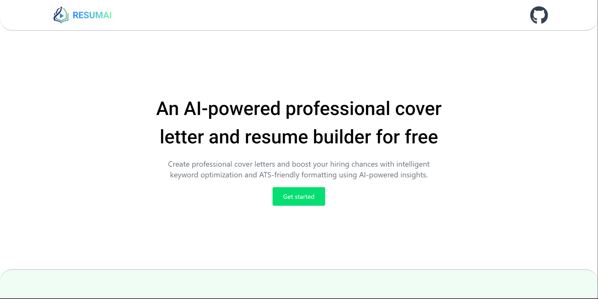

# 📝 AI Resume & Cover Letter Builder

A modern web application that **helps job seekers generate personalized cover letters, improve their resumes, and analyze their resumes for ATS (Applicant Tracking System) compatibility**. Built with **React, Vite, Tailwind CSS, and Framer Motion** for a smooth, interactive user experience.  

---

## 🚀 Live Demo

Check out the live application here:  
[🌐 View Live Demo](https://vercel-link.vercel.app)


---

## 🌟 Features

- **Personalized Cover Letter Generation**  
  Quickly generate professional cover letters tailored to your name, company, and job description.  

- **Resume Improvement**  
  Enhance your existing resume with AI-powered suggestions for better wording, structure, and impact.  

- **ATS Analysis**  
  Check your resume’s compatibility with common Applicant Tracking Systems and improve your ATS score.  
  
- **Instant AI Results**  
  Receive AI-generated suggestions in seconds without complicated setup.  

  - **Interactive UI with Animations**  
  Smooth transitions and animations using **Framer Motion** for a modern, responsive design.  

---

## 🖼 Screenshots

Landing Page:  


---

## ⚙️ Tech Stack

- **Frontend:** React.js + Vite  
- **Styling:** Tailwind CSS  
- **Animations:** Framer Motion  
- **AI API:** Gemini AI API  
- **Deployment:** Vercel  

---

## 📖 How It Works

1. Enter your details (Company name, applying as Fresher/Experienced, select cover letter tone).  
2. Paste your the job and description current resume (optional) .  
3. Click **Generate Cover Letter & resume**.  
4. View AI-generated outputs and suggestions.    

---

## 📂 Clone & Run Locally

```bash
git clone <https://github.com/git_username/resumAI.git>
cd < resumAI >
npm install
npm run dev
```

- Open your browser at [http://localhost:5173](http://localhost:5173) 

- Start generating cover letters and improving your resume instantly!  
  
